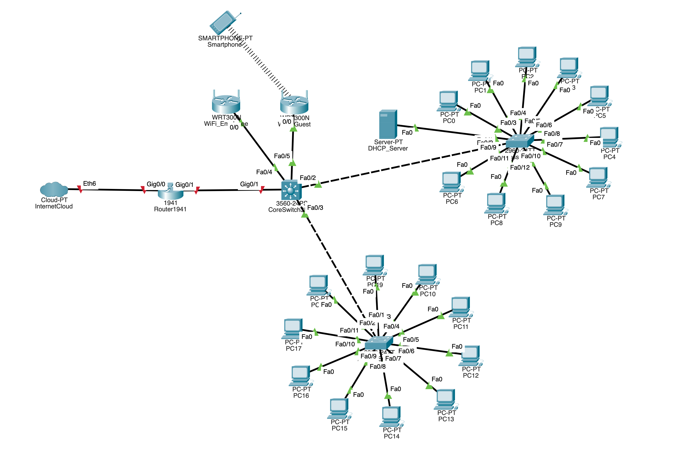

# Small Office Network (Cisco Packet Tracer)

This project simulates a small office network using Cisco Packet Tracer. It includes wired and wireless devices, DHCP configuration, and a hierarchical LAN setup.

## 🔧 Topology Overview

- **1x Router 1941**
- **1x Core Switch (Cisco 3560)**
- **2x Access Switches**
- **2x Wireless Routers (WRT300N)**
- **1x DHCP Server**
- **20+ End Devices (PCs, Laptops, Mobile Devices)**

## 🛠️ Features

- DHCP Server setup for dynamic IP assignment
- Static routing on Router 1941
- Wi-Fi access for mobile and laptop devices
- LAN switching using hierarchical topology
- Network tested using ping and packet flow tools

## 📁 Files

- `office-v-1.pkt` – Cisco Packet Tracer project file
- `docs/network-topology.png` – Network layout snapshot
- `docs/config-summary.txt` – Notes on IPs, routing, and DHCP setup

## 🖼️ Preview

## 🧠 Learning Outcome

This project demonstrates my understanding of:
- Cisco device configuration
- LAN/WLAN setup
- IP addressing and DHCP
- Packet flow testing and troubleshooting

## 🧑‍💻 Author

Md Rakibul Islam  
[LinkedIn](https://www.linkedin.com/in/rakibulislam893/) • [GitHub](https://github.com/raki893)
